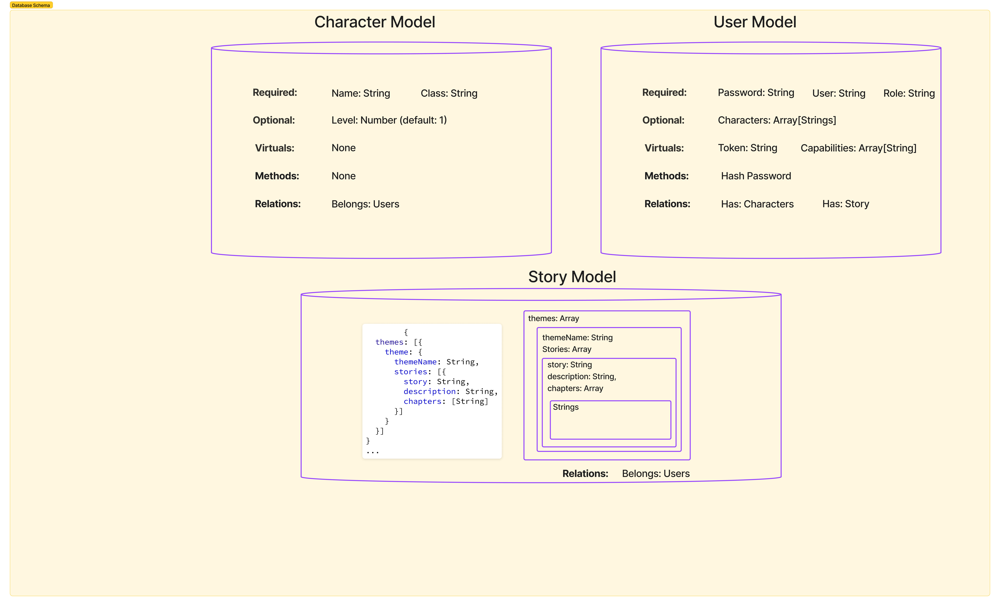

<!-- @format -->

# MIDTERM - D49

## Project: Dungeons and Data

### Author:

### Problem Domain

Not everyone has the time for a full-length D&D game or the ability to play with remote friends. Dungeons and Data take the nostalgic experience and the modern application of being able to play remotely. Choose between a hero or DM, and create your D&D adventure. Create stories, update old stories, gain inspiration from other's stories, and above all, have fun on your endless adventures. Dungeons and data solves the problem of not being able to enjoy D&D with your friends around at the world at anytime.

As a user I want to be able to choose between DM or Hero so that I can play in the role that best fits the group
As a user I want to be able to create new stories so that I can keep the game dynamic for my friends
As a user I want to be able to choose a current story so that I can immediately begin playing with my friends
As a user I want to be able to create a character with a specific class so I can fill a role to play with my friends
As a user I want to be able to view stories that other DMs created so that I can build on or gain inspiration from their adventures
As a Hero I do will not be able to access the stories to keep the mystery of the story fresh
As a Hero I will only be able to read what is presented to me from the DM
As a Hero I want to be able to respond with abilities from the classic D&D game to keep the experience authentic
As a DM I want to be able to control the flow of the game and determine the outcome of the user's experiences
As a DM I will only be able to modify my own stories so that I cannot disrupt another DM's game

### Links and Resources

### Setup

`npm i` to install dependencies
`nodemon` to start server on port 3001

#### `.env` requirements

see `.env.sample`

#### How to initialize/run your application (where applicable)

#### Features / Routes

- Feature one: Deploy to Prod

- GET : `/` - goes to README.md

#### Tests

- How do you run tests?
  - npm test
- Any tests of note?

  - handles every CRUD function
  - handles middleware
  - handles database calls

#### UML

